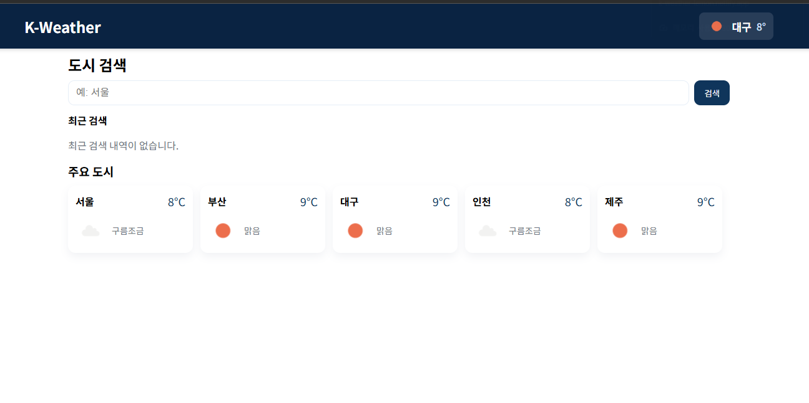
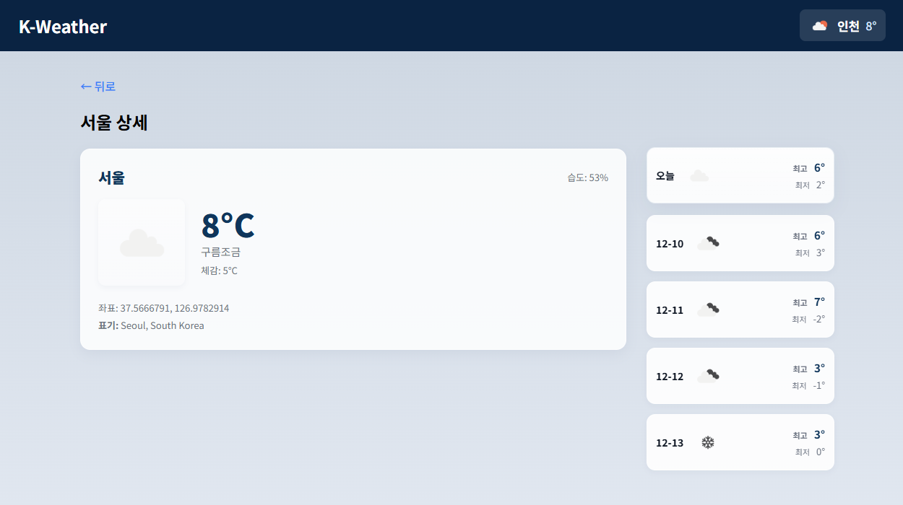

# 🌦️ K-Weather — 실시간 날씨 조회 서비스

사용자가 원하는 도시의 날씨를 조회하고, 주요 도시들의 날씨를 직관적으로 확인할 수 있는 React 기반 웹 애플리케이션입니다.
OpenWeather API를 활용하여 현재 날씨, 5일 예보, 날씨 상태에 따른 동적 배경 변경, 최근 검색 기록 제공 등의 기능을 구현했습니다.

## 🔗 배포 링크

[날씨 바로가기](https://k-weather-lemon.netlify.app/)

## 📌 1. 프로젝트 개요

- React + Vite 기반 SPA(Single Page Application)

- 도시 검색을 통한 현재 날씨 & 5일 예보 조회

- 주요 도시 5개가 3초 간격으로 자동 롤링되는 헤더

- 상세 페이지에서 날씨 상태에 따라 배경 색상이 자동 변경

- 최근 검색 기록(저장 및 삭제 가능)

- 메인/상세 페이지 UI 개선 및 반응형 적용

## 🛠️ 2. 사용 기술

Front-End

- React (Hooks 기반)

- React Router

- CSS (모듈형 스타일링)

- Vite (환경 변수 관리 포함)

- 애니메이션: CSS transition / keyframes

API

- **OpenWeather API**

- Current Weather Data

- 5-Day Forecast (3-hour interval)

- Data Fetching

- API 요청은 fetch() 기반 커스텀 서비스(weatherService.js) 사용

## 🌐 3. 주요 기능

✔ 1) 도시 검색 기능

- 검색창 입력 → API 호출 → 현재 날씨 카드 출력

- 최근 검색 기록 저장(LocalStorage 사용)

- 기록 각각 삭제 가능

✔ 2) 헤더 인기 도시 자동 전환

- "서울, 부산, 제주, 도쿄, 뉴욕" 등 주요 도시 리스트

- 3초마다 자동 전환 (Fade-in 애니메이션 적용)

- 날씨 아이콘 + 현재 온도, 습도 표시

✔ 3) 상세 페이지 구성

- 왼쪽: 오늘 날씨(아이콘, 현재온도, 체감, 바람, 습도 등)

- 오른쪽: 5일 예보(최고/최저 기온, 날짜, 아이콘)

- 가장 위의 카드에 “오늘” 표시

- 페이지 배경이 날씨에 따라 자동 변경
  (clear, clouds, rain, snow, mist 등)

## 📄 4. 페이지 화면 구성

🏠 메인 페이지

- 중앙 검색창

- 최근 검색 내역

- 주요 도시 자동 롤링 헤더

- 시각적 강조를 위한 간격 및 센터 레이아웃

📑 상세 페이지

- 오늘 날씨 카드(왼쪽)

- 5일 예보(오른쪽 컬럼)

- 날씨 상태 기반 배경 전환

- 페이지 전체가 리듬감 있는 카드 UI로 구성

## 화면

[ 메인 페이지 ]

---

[ 상세 페이지 ]

